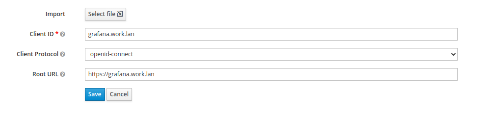
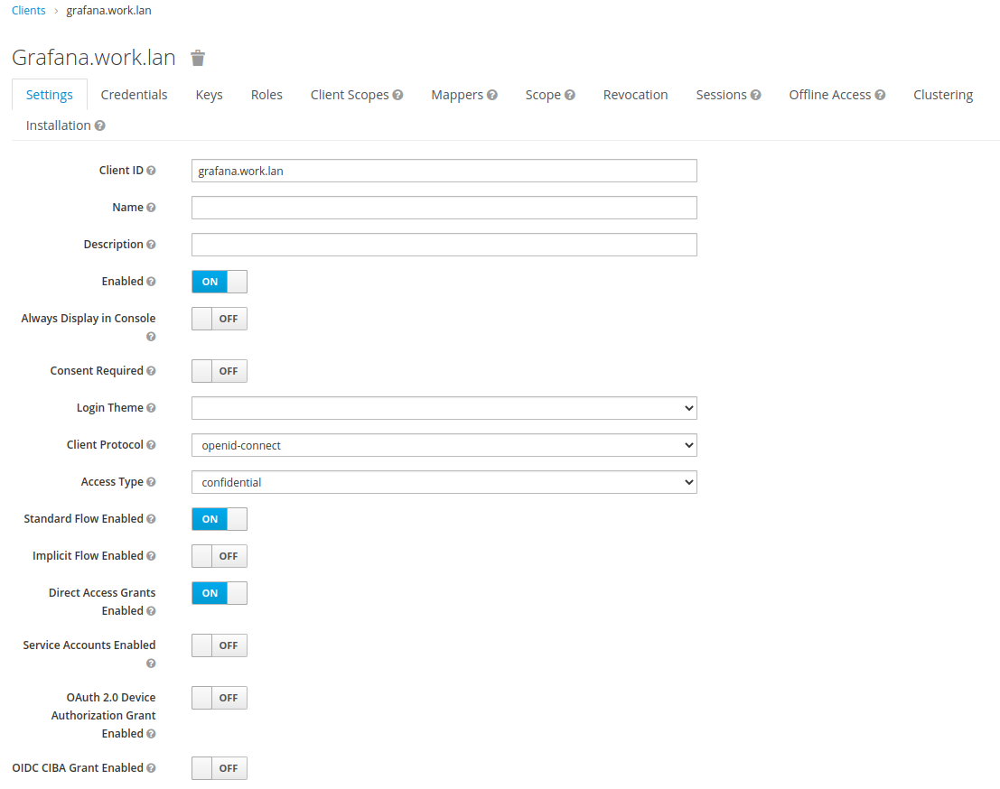
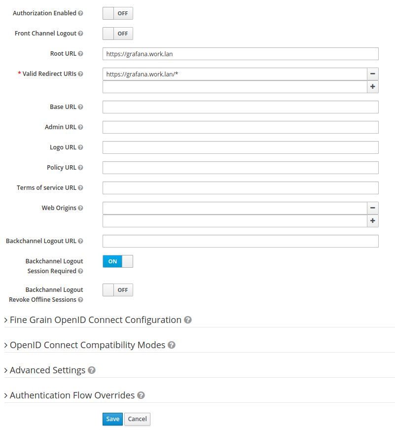
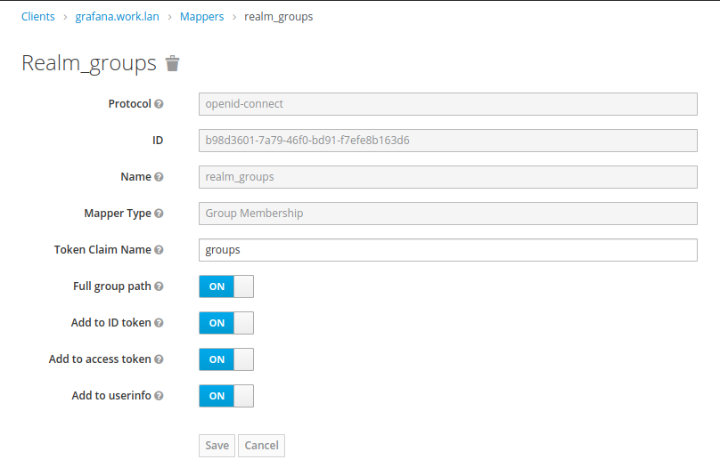
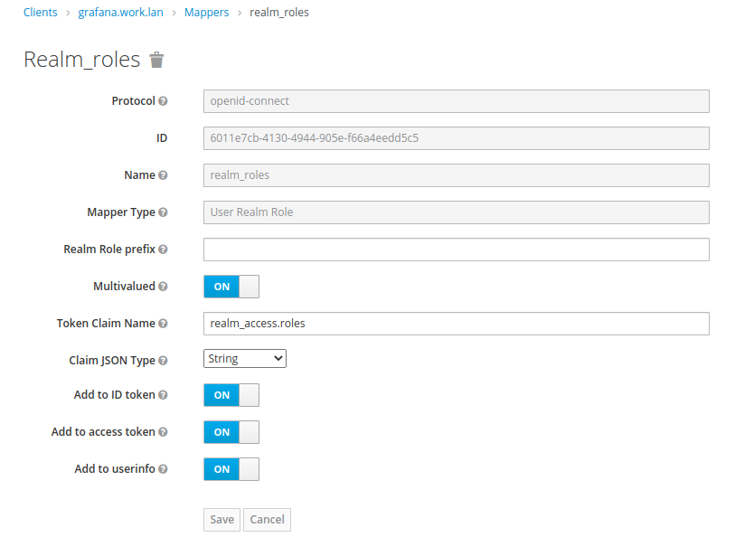
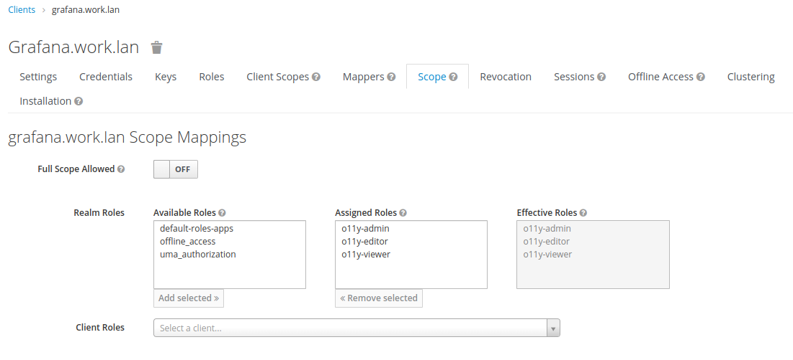

# Local Cloud Native Lab

- [Local Cloud Native Lab](#local-cloud-native-lab)
  - [Tested on](#tested-on)
  - [Prerequisites on host machine](#prerequisites-on-host-machine)
  - [Component Architecture](#component-architecture)
  - [Install procedure](#install-procedure)
    - [Setup Ansible Inventory File](#setup-ansible-inventory-file)
    - [Create private group_var file](#create-private-group_var-file)
    - [Generate Self Signed Certificates](#generate-self-signed-certificates)
    - [Install all components](#install-all-components)
  - [Details about components](#details-about-components)
    - [Keycloak](#keycloak)
      - [Realm structure](#realm-structure)
        - [Users roles and groups](#users-roles-and-groups)
        - [Open Id Connect (OIDC) Clients](#open-id-connect-oidc-clients)
    - [Grafana Enterprise](#grafana-enterprise)

Ansible Playbooks using to install with plain old Docker for dev environments a set of essential components for modern cloud native appdev stack such as Grafana, Prometheus, Loki, Kafka, Activemq Artemis, Nexus, Portainer, Traefik.

if you want the raw roles and build your own playbooks go here : 

https://github.com/alainpham/cloud-native-appdev-lab-role

## Tested on 

Ubuntu 22.04LTS


## Prerequisites on host machine

- Ansible
- JDK 17+ as we are using keytool to generate self signed certificates
- Dnsmasq or other dns servers that can resolve local dns names like *.localmachine.lan to the local loopback address
- Docker to run the containers

Install packages

```
sudo apt install dnsmasq openjdk-17-jdk prometheus-node-exporter ansible docker.io docker-compose apparmor
```

Add your user to docker group and configure a separate network for all deployed containers.

```
sudo adduser <your_user> docker

docker network create --driver=bridge --subnet=172.18.0.0/16 --gateway=172.18.0.1 primenet
```

Enable dnsmasq on Network Manager

```
sudo bash -c 'cat > /etc/NetworkManager/conf.d/00-use-dnsmasq.conf << _EOF_
[main]
dns=dnsmasq
_EOF_'

sudo bash -c 'cat > /etc/NetworkManager/dnsmasq.d/dev.conf << _EOF_
#/etc/NetworkManager/dnsmasq.d/dev.conf
listen-address=127.0.0.1,172.18.0.1,172.17.0.1
address=/${HOSTNAME}.lan/172.18.0.1
_EOF_'
```

disable running default dnsmasq service

```
sudo systemctl stop dnsmasq
sudo systemctl disable dnsmasq
```

disable systemd-resolved on ubuntu

```
sudo systemctl disable systemd-resolved
sudo systemctl stop systemd-resolved
sudo rm /etc/resolv.conf
sudo touch /etc/resolv.conf
```

restart network manager

```
sudo systemctl restart NetworkManager
```


## Component Architecture


## Install procedure

### Setup Ansible Inventory File

List all your possible target hosts to install the stack on in the following file: [inventory/inventory.yml](inventory/inventory.yml)

In the `selected` block choose the hosts or groups you want to run scripts on for now.

### Create private group_var file

If you don't use Grafana Enterprise and/or Grafana Agent to send metrics and logs to Grafana Cloud you can ignore this step.

This file is in order to provide sensible information about your system.
Currently it should hold the following infos

- Grafana Enterprise License Key
- Grafana Cloud Metrics & Logs API Key

You should create a a file in `playbooks/group_vars/all.yml`
that should contain the following content.

```
---
secretappconfig:
  grafana-enterprise:
    license: xxx
  grafana-agent:
    metrics:
      url: https://prometheus-prod-01-eu-west-0.grafana.net/api/prom/push
      user: <api_user>
      pwd: <api_key>
    logs:
      url: https://<api_user>:<api_key>@logs-prod-eu-west-0.grafana.net/loki/api/v1/push

```

### Generate Self Signed Certificates

In order to be able to use Traefik with HTTPS and possibily SNI. We are generating a certificate auhtority and a wildcard certificate for all our services.

```
ansible-playbook playbooks/01-tls-setup.yml
```

Optionally you can run these commands to trust your self signed certs.

```
cp /home/$USER/apps/tls/$HOSTNAME.lan-root-ca.pem /usr/local/share/ca-certificates/$HOSTNAME.lan-root-ca.pem

sudo update-ca-certificates
```

You can also import it in Chrome to avoid TLS warnings.


### Install all components

Install all the containers and services

```
ansible-playbook playbooks/03-app-infra.yml
```

## Details about components

### Keycloak

The realm called app is imported from the following file. 

[cloud-native-appdev-lab-role/templates/keycloak/config/apps-realm.json](cloud-native-appdev-lab-role/templates/keycloak/config/apps-realm.json)

If you make any changes and want to export the realm file again, do the following : 

```
docker exec keycloak /opt/keycloak/bin/kc.sh export --realm apps --users realm_file --file /opt/keycloak/data/apps-realm.json
```

Get the file from the folder
/home/{{ ansible_user }}/apps/{{appname}}/data

#### Realm structure

The realm is structured as follows.

##### Users roles and groups

- Roles that will be mapped to basic Grafana roles
  - o11y-admin
  - o11y-editor
  - o11y-viewer
- Users and Groups that will be mapped to Teams using team sync (in Grafana Enterprise Only). In this example we have 2 teams egyptian and greek gods, whith each having group having users with different roles.
  - Group : egypt
    - o11y-admin : ra
    - o11y-editor : osiris
    - o11y-viewer : ra
  - Group : greece
    - o11y-admin : zeus 
    - o11y-editor : hera
    - o11y-viewer : chimera
- Users without and group and role
    - john
    - jane

##### Open Id Connect (OIDC) Clients 

There are 3 Client configured
- grafana.$HOSTNAME.lan
- grafana-enterprise.$HOSTNAME.lan
- grafana-alpha.$HOSTAME.lan

They are all configured the following way. This is an example for grafana.$HOSTNAME

1. Go to Clients -> Create
2. Fill in the following fields 



3. Fill in the fields as follows





4. Create Mappers to have certain information place in the access token





5. Limit scope of roles to o11y roles




### Grafana Enterprise

This instance is configured with
-  oauth/OIDC 
-  Teamsync based on the group of the user
-  whitelabling
-  Editors can admin
-  Custom rbac role that allows "team admins" have editors rights and can create data sources and edit permissions on the ones they have created.

This instance allows several teams to self serve by creating folders and datasources that they can manage on their own. Team admins can edit permissions of their folders and datasources to give access to other teams.