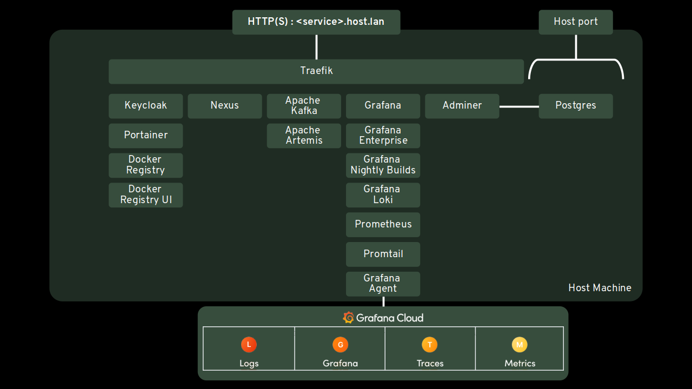

# Local Cloud Native Lab

- [Local Cloud Native Lab](#local-cloud-native-lab)
  - [Prerequisites](#prerequisites)
  - [Component Architecture](#component-architecture)

Playbooks using to install with plain old Docker for dev environments a set of essential components for modern cloud native appdev stack such as Grafana, Prometheus, Loki, Kafka, Activemq Artemis, Nexus, Portainer, Traefik.

if you want the raw roles and build your own playbooks go here : 

https://github.com/alainpham/cloud-native-appdev-lab-role

## Prerequisites

- dnsqmaasq or other dns servers that can resolve local dns names like *.local.lan to the local loopback address
- docker

## Component Architecture

